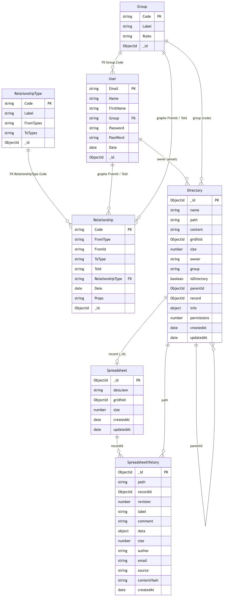
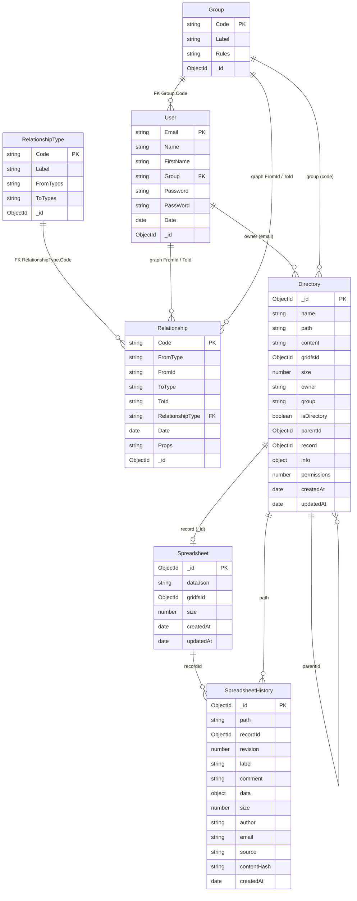
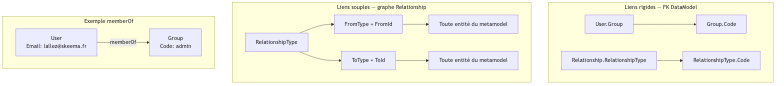
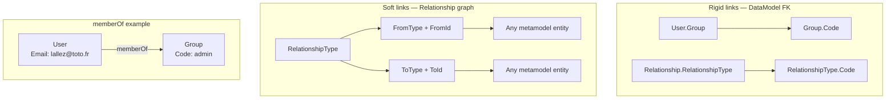

# MongoDB schema — Skeepto

> Source: `DataModel.json` v1.1 + runtime collections (Directory, Spreadsheet, …)  
> Last updated: June 2026

Related files:

| File | Description |
|---------|-------------|
| [`diagrams/database-overview.mmd`](./diagrams/database-overview.mmd) | Mermaid source — ER overview |
| [`diagrams/database-overview.png`](./diagrams/database-overview.png) | PNG export — ER overview |
| [`diagrams/relationship-models.mmd`](./diagrams/relationship-models.mmd) | Mermaid source — relationship models |
| [`diagrams/relationship-models.png`](./diagrams/relationship-models.png) | PNG export — relationship models |

---

## 1. Collection overview

### Legend

| Symbol | Meaning |
|---------|---------------|
| **PK** | Business primary key (metamodel) or MongoDB `_id` |
| **FK** | Foreign key validated by `SkGenericDb` |
| **graph** | Link via `Relationship.FromType/FromId` → `ToType/ToId` |

### Collections by layer

| Layer | Collections | API |
|--------|-------------|-----|
| **DataModel** | `User`, `Group`, `Relationship`, `RelationshipType` | `POST/GET/DELETE /mdb/:table` |
| **Runtime** | `Directory`, `Spreadsheet`, `SpreadsheetHistory` | `/files/...`, `.sker` save |
| **Binary** | GridFS (`fs.files`, `fs.chunks`) | via `gridfsId` |

---

## 2. Two relationship models

### Comparison

| Type | Mechanism | Integrity | Typical use |
|------|-----------|-----------|---------------|
| **Classic FK** | Column → referenced table | Validated on every insert/update | Required structure (`User` ∈ `Group`) |
| **Relationship** | `FromType/FromId` → `ToType/ToId` + `RelationshipType` | Validated by catalog type + entity existence | Generic business links, with history (`date`, `Props`) |

---

## References

- Declarative definition: [`DataModel.json`](./DataModel.json)
- Metamodel documentation: [`DOCUMENTATION_DATAMODEL_METAMODEL.md`](../DOCUMENTATION_DATAMODEL_METAMODEL.md)
- Virtual disk: [`SkVirtualDiskDb.mjs`](../SkVirtualDisk/SkVirtualDiskDb.mjs)
- `.sker` storage: [`SkSkerStorage.mjs`](../SkSpreadSheet/SkSkerStorage.mjs)
