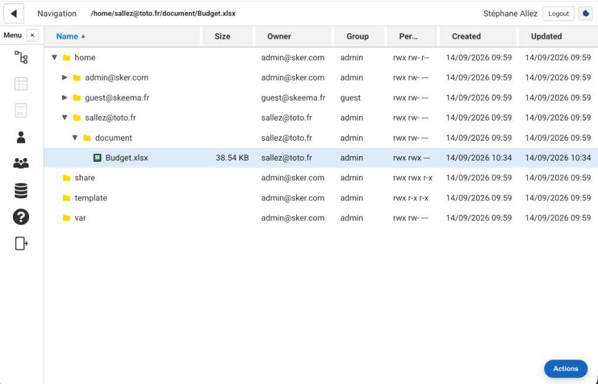
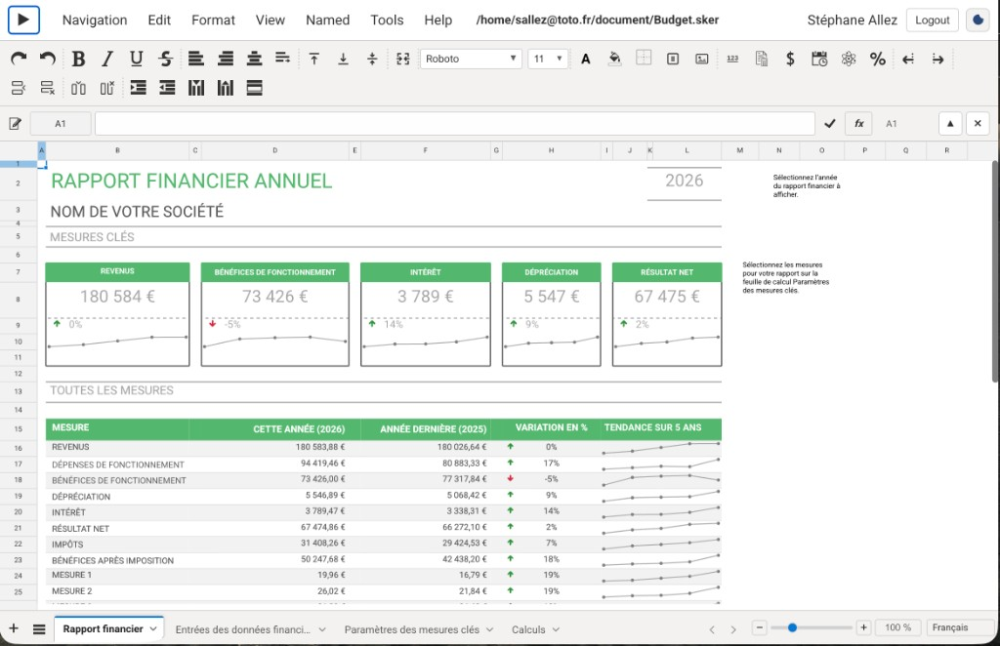

# Import Excel (`.xlsx`) into Skeepto

Skeepto does not open `.xlsx` files in the grid. You **upload** a real Excel workbook, **convert** it to `.sker`, then **open** that file.

Only **`.xlsx`** (Office Open XML) is converted. `.xls`, `.xlsm` and `.xlsb` can sit on the virtual disk but **Convert Excel** will refuse them. **VBA / macros are not imported.**

## Web app (virtual disk)

You must be signed in, with the server running and `npm run build` already done.

### 1. Upload the `.xlsx`

1. Open **Virtual disk**.
2. Go to the folder where you want the file (for example your home folder).
3. Open **Actions** (bottom-right, or right-click the tree).
4. Choose **Upload** and pick a `.xlsx` from your computer.

The file appears in the current folder with the same name.

### 2. Convert to `.sker`

1. Select the `.xlsx` in the tree (a single click is enough).
2. **Actions → Convert Excel**.

Wait until the conversion finishes. A large workbook can take several minutes. The converter writes a sibling file:

| Excel | Result |
|-------|--------|
| `/home/sallez@toto.fr/Budget.xlsx` | `/home/sallez@toto.fr/Budget.sker` |

The original `.xlsx` is left in place.

### 3. Open the `.sker`

Double-click **`Budget.sker`** (or the name you uploaded). Skeepto loads the native workbook in the spreadsheet.

That is the file you edit, save, and collaborate on. You do not need to convert again unless the Excel source changes.

## Desktop app (Electron)

Offline mode has no virtual disk. Use the native **File** menu to import an `.xlsx`; Skeepto converts it to a temporary `.sker` and opens it. Save as `.sker` if you want to keep the result.

## Limits

- The file must be a real Excel `.xlsx`, not a `.sker` renamed to `.xlsx`.
- Formulas, values, and most formatting are converted; macros are not.
- You need write permission on the folder (conversion creates a new file next to the `.xlsx`).
