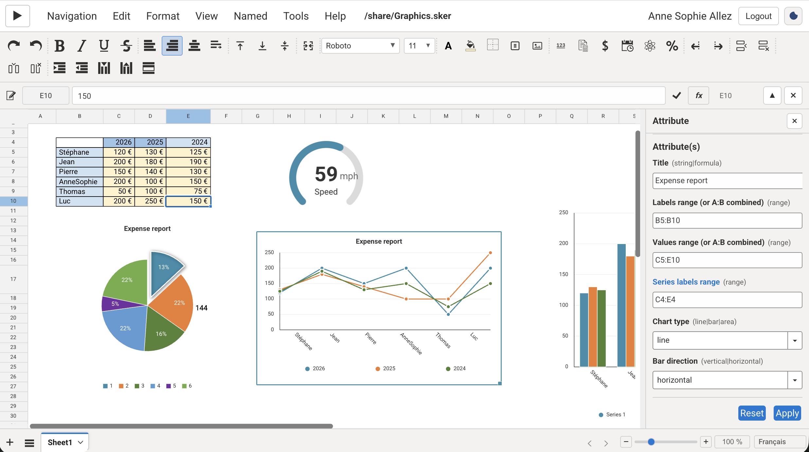

# Spreadsheet React classes and Unit classes

This document describes the **React** architecture of the Skeepto spreadsheet
(`src/spreadsheet/`) and the **Unit classes** in the C++ engine
(`skeepto-engine`). The two sides meet through WASM: the canvas paints a JSON
viewport (`JsonView`), React widgets overlay class-typed cells, and physical /
monetary units live in the engine.

C++ paths are relative to `skeepto-engine/`. JavaScript paths are relative to
`skeepto/src/spreadsheet/`.

---

## 1. Two meanings of “class”

In the spreadsheet, *class* refers to three distinct families:

| Family | Where it lives | Role | Rendering |
|--------|----------------|------|-----------|
| **React UI** (`SkSpreadSheet`, `SkSpGridCanvas`, …) | `skeepto` | Chrome, grid, menus, editing | React components / canvas |
| **CellClass widgets** (`SkCellClassCheck`, …) | `skeepto` + WASM factory | Interactive widgets in a cell or as a floating object | React overlay (`SkSpGridPanel`) |
| **Units** (`tClassUnit`, `tCellClassUnit` / `tCellUnit`) | `skeepto-engine` | Quantity + SI / currency unit, dimensional arithmetic | Painted **on the canvas**, not a React widget |

Units are **not** in the CellClass palette (`SkSpClass` filters them out).
Apply them from **Tools → Unit** (`SkSpUnit`) or the `unit:family:unit` menu
action.

---

## 2. Spreadsheet React architecture

### 2.1 Layers

```
SkSpreadSheet                    React shell (lifecycle, menus, recalc)
  └─ SkSpInterface               JS hub: selection, JsonView, reloadView
       └─ SkUISpreadSheet        Wrapper around window.SpreadSheet.UISpreadSheet (WASM)
            └─ tUISpreadSheet    C++ / WASM (workbook, formulas, units, CellClass)
```

`SkSpInterface` is **not** a React component. It is the shared object
(`props.SpInterface`) that almost every UI class keeps as
`this.m_SpInterface`. It also stores back-references to panels
(`m_SkSpreadSheet`, `m_SkSpGridPanel`, `m_SkSpCommand`, …) so they can
invalidate after `reloadView()`.

`window.SkUISpreadSheet` and `window.SkSpreadSheet` are globals set at startup
for WASM callbacks and the application menu.

### 2.2 Component tree

```
SkSpreadSheet
├── SkSpTopCommand          ribbon (align, format, merge, unit popup, …)
├── SkSpControlPanel        formula bar (ref + value + commit)
├── SkSpTopPanel            column-letter headers (canvas)
├── SkSpClient
│   ├── SkSpLeftPanel       row numbers + outline (canvas)
│   └── SkSpGridCanvas      grid, scroll, mouse, freeze panes (canvas)
│       ├── SkSpCellCanvas  cell paint (text, unit, CF)
│       ├── SkSpGridPanel   React overlay for CellClass (check, combo, …)
│       ├── SkSpFloatingLayer  floating objects (charts, image, textbox)
│       └── SkSpInplaceEdit in-cell / formula-bar editor
├── SkSpCommand             right panel (tab stack)
│   ├── Font, Border, Class, Function, Attribute
│   ├── Unit  →  SkSpUnit
│   ├── Named ranges / formulas, Tables, Print
│   ├── Chat, AI assistant, Conditional, Find, Debug
└── SkSpSheetTab            sheet tabs
```

The **canvas** (`SkSpGridCanvas` + `SkSpCellCanvas`) draws the grid, values,
units, and format. **Widgets** (`SkSpGridPanel`) appear only for JsonView cells
with `c_t === "c"` and a `c_v.co` marker (a CellClass registered on the JS
side). A unit cell has `c_v.n === "tCellUnit"` **without** `co`: it stays
canvas-painted.

### 2.3 JsonView flow

1. A UI action calls `SkUISpreadSheet` (value, format, `applyUnit`, …).
2. The C++ engine mutates the workbook and, if needed, recalculates.
3. `SkSpInterface.reloadView()` requests a JSON viewport (`JsonView`).
4. `SkSpGridCanvas` repaints; `SkSpGridPanel` rebuilds visible widgets.

Class cells arrive as:

```json
{
  "c_t": "c",
  "c_v": {
    "n": "SkCellClassCheck",
    "co": { },
    "c": { "t": "b", "v": true }
  }
}
```

- `c_v.n` = React / factory **type** (never the instance name).
- `c_v.c` = payload (calculable value, attributes).
- `c_v.co` = marker that this cell has a React renderer.

---

## 3. React chrome classes

Most of these extend `SkComponent` (`src/component/SkComponent.js`). A few
are plain wrappers (`SkSpClient`, `SkSpUnit`, `SkSpPrintParameters`).

| Class | File | Role |
|-------|------|------|
| `SkSpreadSheet` | `SkSpreadSheet.js` | Shell: WASM ready, menus, undo, cooperative recalc, right panel |
| `SkSpInterface` | `SkSpInterface.js` | Hub: selection, JsonView, freeze, tables, collaboration |
| `SkUISpreadSheet` | `SkUISpreadSheet.js` | JS bridge → `UISpreadSheet` WASM (~150 methods) |
| `SkSpTopCommand` | `SkSpTopCommand.js` | Ribbon: font, alignment, merge, formats, Unit popup |
| `SkSpControlPanel` | `SkSpControlPanel.js` | Formula bar, read-only, ribbon visibility |
| `SkSpTopPanel` | `SkSpTopPanel.js` | Canvas for column letters |
| `SkSpLeftPanel` | `SkSpLeftPanel.js` | Canvas for row numbers + tree/outline |
| `SkSpClient` | `SkSpClient.js` | Assembles left panel + grid |
| `SkSpGridCanvas` | `SkSpGridCanvas.js` | Main canvas: scroll, selection, drag, freeze |
| `SkSpCellCanvas` | `SkSpCellCanvas.js` | Paints one cell (text, unit suffix, data bars) |
| `SkSpGridPanel` | `SkSpGridPanel.js` | Overlay for CellClass widgets (including frozen panes) |
| `SkSpFloatingLayer` | `SkSpFloatingLayer.js` | Overlay for floating objects |
| `SkSpInplaceEdit` | `SkSpInplaceEdit.js` | In-cell editor + function suggestions |
| `SkSpSheetTab` | `SkSpSheetTab.js` | Sheet tabs |
| `SkSpCommand` | `SkSpCommand.js` | Right panel (tab stack) |
| `SkSpClass` | `SkSpClass.js` | Palette to apply a CellClass |
| `SkSpClassAttribute` | `SkSpClassAttribute.js` | Edit properties of the widget under the cursor |
| `SkSpUnit` | `SkSpUnit.js` | Unit catalog → `applyUnit` |
| `SkSpFunction` | `SkSpFunction.js` | Worksheet function list |
| `SkSpRangeNamed` / `SkSpFormulaNamed` | `SkSpRangeNamed.js`, `SkSpFormulaNamed.js` | Names |
| `SkSpTables` | `SkSpTables.js` | Structured tables |
| `SkSpFind` | `SkSpFind.js` | Find |
| `SkSpConditionalFormat` | `SkSpConditionalFormat.js` | Conditional formats |
| `SkSpPrintParameters` | `SkSpPrintParameters.js` | Print layout |
| `SkSpAiChat` | `SkSpAiChat.js` | AI assistant |

`SkSpRightPanel` still exists, but the current shell mounts `SkSpCommand`
directly in the right column of `SkSpreadSheet`.

---

## 4. CellClass React widgets

### 4.1 Registry

`SkCellClass` (`CellClass/SkCellClass.js`) is the ancestor. After WASM loads,
`SkCellClassContainer` calls `registerClassAttribute()` on each widget. That:

1. Registers a JS **renderer** (`GetRender(className)`).
2. Registers the model on the C++ side (`RegisterClassAttribute` + `AddProperty`).

`addProperty` on the JS model becomes a C++ property on `tCellModelClassAttribute`.
Each property is a **first-class cell** (`tCellAttribute`) hanging off the host.
The formula parser treats it as a member of the instance — that is how charts
are wired (see [4.3](#43-attributes-in-formulas)).

`SkSpGridPanel.RenderObject()` reads `c_v.n` and calls `GetRender`. Cross-cutting
behavior is declared with `static cellClassCapabilities()`:

| Capability | Effect |
|------------|--------|
| `floatingObject` | May live outside a cell (`SkSpFloatingLayer`) |
| `selfEditing` | Own editor; no generic `SkSpInplaceEdit` overlay |
| `inplaceEditBlocked` | No in-cell text edit (toggle, sparkline) |
| `calculableModelValue` | Scalar in `c_v.c.t` / `c_v.c.v` (bool, date, string) |

### 4.2 Registered widgets

| Class | Kind | Capabilities | Notes |
|-------|------|--------------|--------|
| `SkCellClassCheck` | Checkbox | inplace blocked, calculable bool | Value in the model, label as attribute |
| `SkCellClassSwitch` | Switch | same | |
| `SkCellClassButton` | Button | — | `onClick` event |
| `SkCellClassComboBox` | List | self-editing, calculable string | |
| `SkCellClassCalendar` | Date | self-editing, calculable date | |
| `SkCellClassSparkline` | Mini chart | inplace blocked | Stays in the cell |
| `SkCellClassCanvas` | Free canvas | floating | |
| `SkCellClassPieChart` | Pie | floating | |
| `SkCellClassLineChart` | Line | floating | |
| `SkCellClassGauge` | Gauge | floating | |
| `SkCellClassImage` | Image | floating | |
| `SkCellClassTextBox` | Text box | floating | |

There is **no** `SkCellClassUnit.js`. The unit is an **engine** class.

### 4.3 Attributes in formulas

Placing a class on a cell does more than draw a widget. The instance **exposes
every registered property** to the worksheet formula language.

Put `MaClasse` on **A1**. If the model registered `myAttribute`, then **B1**
can read it:

```text
B1 = A1.myAttribute
```

The Lemon grammar accepts a cell (or an identifier) followed by `.Attribute`
(`CELL attribute` / `ID attribute` in `SkLemonSpreadSheet.y`). At evaluation,
`PushCell` / `PushID` resolve that member to the `tCellAttribute` on the
host (`tLemonInterface::CellAttribute`). The attribute sits on the calculation
path like any other cell: dependents recalc when it changes.

Two equivalent spellings:

| You type | What it binds |
|----------|----------------|
| `=A1.myAttribute` | Host **address** + property name |
| `=MaClasse.myAttribute` | Instance **ref name** (`RefName()`) + property name |

The engine often **rewrites** the address form to the instance name when
displaying the formula. Example from the unit tests: `=A3.Int+1` is stored /
shown as `tTestClass2.Int+1`. Clearing the host becomes `#REF!.Int`.

An attribute is itself a formula cell:

```text
A1.Int          = 12              literal
A1.Temperature  = A1.Int          another attribute of the same instance
A1.Name         = JSON(B2:B4)     worksheet function
C1              = A3.Int+1        another cell reading the instance
```

The Attribute tab (`SkSpClassAttribute`) edits these properties. Range-kind
properties (`kind: "range"`) store an A1 range (or a formula that evaluates
to one). The widget reads the **evaluated** value via `GetProperty` /
`resolvePropertyRangeRef`.

Deleting the host invalidates every `Host.attr` reference (`#REF!.attr`).
Moving a range updates attribute formulas the same way as ordinary cell refs.

### 4.4 How charts use attributes

Charts are not a separate data pipeline. `SkCellClassLineChart` /
`SkCellClassPieChart` / `SkCellClassGauge` / `SkCellClassSparkline` register
properties, then the React widget **reads those attributes** to know what to
plot.



The Attribute tab on the selected chart (`Graphics.sker`) binds `Title`,
label range `B5:B10`, value range `C5:E10`, and series labels `C4:E4` to the
table on the left. Gauge, pie, line, and bar widgets all consume the same
kind of properties.

Typical LineChart model (`registerClassAttribute`):

| Property | Kind | Role |
|----------|------|------|
| `Title` | string | Chart title (literal or `=Sheet1!A1`) |
| `chartData` | range | Labels, or combined labels+values |
| `DataRange` | range | Values (or combined A:B block) |
| `seriesLabels` | range | Series names |
| `chartType` | enum | `line` / `bar` / `area` |
| `barDirection` | enum | `vertical` / `horizontal` |

So if the chart class sits on A1 (or as a floating object anchored on `_$$A`):

```text
A1.Title          = Expense report
A1.chartData      = B5:B10
A1.DataRange      = C5:E10
A1.seriesLabels   = C4:E4
```

The widget calls `resolvePropertyRangeRef(cell, "chartData")` (and
`DataRange`, …), pulls the viewport values, and paints. Another cell can
still do `=A1.Title` or `=A1.DataRange` — same member syntax as
`=A1.myAttribute`.

Floating charts keep the same attributes on the hidden host cell `_$$A`;
the formula language still addresses them by instance name.

---

## 5. Unit classes (engine)

### 5.1 `tClassUnit` — unit descriptor

Files: `Libraries/SkRoot/include/SkUnit.hpp`, `source/SkUnit.cpp`.

Extends `tClass`. An instance holds:

- `m_Family` — family (`t_UnitFamily`)
- `m_Union` — concrete unit in that family (money, length, time, mass)
- `m_Power` — exponent (`m²` → power 2). Currencies do not use power.

Engine catalog families:

| `t_UnitFamily` | API name | Concrete units | SI conversion |
|----------------|----------|----------------|---------------|
| `Monetary` | `Monetary` | eur, usd, gpb, yen, chf, cad, aud | no (strict equality) |
| `Length` | `Length` | micron, millimeter, centimeter, meter, kilometer | to **meter** |
| `Time` | `Time` | millisecond, second, minute, hour, day, month, year | to **second** |
| `Mass` | `Mass` | milligram (`mg`), gram (`g`), kilogram, tonne (`to`) | to **gram** |
| `AmountOfSubstance`, `ElectricCurrent`, `TemperatureKelvin`, `LuminousIntensityCandela` | (enums) | — | **not yet** wired in `ApplyUnit` |

Useful methods:

- `ToSi(raw)` / `FromSi(si)` / `SiScaleFactor()` — display scalar ↔ canonical quantity
- `GetSymbol()` — `€`, `cm`, `s`, …
- `IsSameFamily` / `IsSameUnity` — comparison
- `Json` / `JsonJavaScript` — persistence vs web viewport

`SiCanonicalUnit(family, power)` builds the SI base unit (m, g, s) after a
multiply / divide that mixes units of the same family (`cm * m` → `m²`).

### 5.2 `tCellClassUnit` — typed value in a cell

Files: `Libraries/SkSpreadSheet/include/SkCellClassUnit.hpp`,
`source/SkCellClassUnit.cpp`.

Factory name: **`tCellUnit`** (`ClassName()`). That is the name JsonView
exposes as `c_v.n`.

Fields:

| Field | Role |
|-------|------|
| `m_Value` (via `tCellClass`) | Numeric scalar |
| `m_UnitClass` | Numerator (`m`, `€`, `cm²`) |
| `m_UnitClassFrac` | Optional denominator (`s` → `m/s`) |
| `m_Error` | Dimensional / currency mismatch |

`tCellModelClassUnit` registers the model: **data is saved** (`SaveData`),
the model is not (`SaveModel` = false).

#### Arithmetic

`+ - * /` are the `tVariant` operators used by formula calculation.

**Addition / subtraction**

- Length, mass, time (including compounds such as `m/s`): SI conversion,
  same dimension and exponent, result in the **left** unit.
  Example: `1 km + 500 m` → `1.5 km`.
- Money: same currency only (`€ + $` → error).
- Otherwise: units must be identical, else `m_Error`.

**Multiplication**

- Same SI family + power: exponents add (`cm * cm` → `cm²`).
- Different families with no fraction: error (no generic `N·m` yet).
- Fractions: `MultiplyOrDivide` simplifies numerator / denominator, then SI
  conversion when possible.
- Power 0 → the result becomes a **bare scalar** (`m / m` → number).

**Division**

- Same concrete unit: exponent decreases.
- Same SI family, same power: dimensionless ratio.
- Otherwise: the divisor becomes the denominator (`m / s` → `m/s`).

SI conversion is implemented for Length, Mass, and Time. Other families (and
money) are not converted.

### 5.3 Applying from the UI

```
SkSpUnit / menu unit:Family:unit
    → SkUISpreadSheet.applyUnit(ref, family, unit)
        → tUISpreadSheet::_ApplyUnit
            → tApi::UndoApplyUnit   (undoable)
                → tCellClassUnit(empty, tClassUnit)
                → UndoCellClass(ref, variant)
```

`UndoApplyUnit` (`Libraries/SkSpreadSheet/source/SKApi.cpp`) parses the
`family` / `unit` **strings** with `UnitFamily()` / `UnitMoney()` / … JS
identifiers **must** match `m_Name` in `SkUnit.hpp`.

The UI catalog is `SkUnitDefinitions.js` (`UNIT_MENU_FAMILIES`). It is kept
in lockstep with the engine `CstRecUnit*` tables.

### 5.4 Viewport JSON (canvas)

`tCellClassUnit::JsonJavaScript` emits a compact object **without** `co`:

```json
{
  "c_t": "c",
  "c_v": {
    "n": "tCellUnit",
    "t": "d",
    "v": 12.5,
    "u": "cm",
    "p": 2,
    "fu": "s",
    "fp": 1
  }
}
```

| Key | Meaning |
|-----|---------|
| `u` | Numerator symbol |
| `p` | Numerator exponent (always emitted for L/M/T) |
| `fu` / `fp` | Denominator symbol / exponent |
| `e` / `se` | Dimensional error (display suffix) |

`SkSpCellCanvas` (`cellUnitSuffixFromJson`) appends the Unicode suffix
(`12.5 cm²/s`). A `tCellUnit` cell is always painted, even when formatted
text is empty.

**File** JSON (`.sker`) uses `tClassUnit::Json` with `pw` instead of `p`.
The canvas accepts both.

### 5.5 `tClassUnitContainer` — broader JSON catalog

Files: `Libraries/SkRoot/include/SkClassUnitContainer.hpp`,
`Libraries_test/SkSpreadSheet/data/UnitCurrencyModel.json`.

Loads a `UnitCurrencyModel` schema: physical units with a dimension vector,
ISO 4217 currencies, money rules (no cross-currency add without FX, no
`money * money`, and so on).

This registry is **not** yet the `ApplyUnit` / `tCellClassUnit` path.
Runtime still uses the enums in `SkUnit.hpp`.

---

## 6. Adding a unit or a widget

### New unit (current runtime)

1. Add the enum and `CstRecUnit*` row in `SkUnit.hpp`.
2. Extend `GetSymbol` / `SiScaleFactor` in `SkUnit.cpp` if needed.
3. Wire `UndoApplyUnit` if it is a new family.
4. Duplicate the entry in `SkUnitDefinitions.js` (`apiFamily` / `apiUnit`
   identical to the C++ `m_Name` values).

### New CellClass widget

1. Create `CellClass/SkCellClassXxx.js` extending `SkCellClass`.
2. Implement `ClassName()`, `Icon()`, `registerClassAttribute()`, and optionally
   `cellClassCapabilities()`.
3. Import and register it in `SkCellClassContainer.js`.
4. Rebuild WASM only if C++ changes; the JS registry is enough for a widget
   whose model is already `RegisterClassAttribute` on the engine side.

---

## 7. Key files

| Topic | File |
|-------|------|
| React shell | `skeepto/src/spreadsheet/SkSpreadSheet.js` |
| Hub | `skeepto/src/spreadsheet/SkSpInterface.js` |
| WASM bridge | `skeepto/src/spreadsheet/SkUISpreadSheet.js` |
| Unit paint | `skeepto/src/spreadsheet/SkSpCellCanvas.js` |
| Widget overlay | `skeepto/src/spreadsheet/SkSpGridPanel.js` |
| Palette / unit exclusion | `skeepto/src/spreadsheet/SkSpClass.js` |
| Attribute panel | `skeepto/src/spreadsheet/SkSpClassAttribute.js` |
| Attribute host / `tCellClassAttribute` | `skeepto-engine/Libraries/SkSpreadSheet/include/SkCellClassAttribute.hpp` |
| Formula `.attr` (`PushCell` / `PushID`) | `skeepto-engine/Libraries/SkSpreadSheet/source/SkLemonInterface.cpp` |
| Grammar `CELL attribute` | `skeepto-engine/Libraries/SkSpreadSheet/lemon/SkLemonSpreadSheet.y` |
| Attribute tests (`=A3.Int`) | `skeepto-engine/Libraries_test/SkSpreadSheet/source/TestSkCellClassAttribute.cpp` |
| Unit menu | `skeepto/src/spreadsheet/SkSpUnit.js` |
| UI catalog | `skeepto/src/spreadsheet/SkUnitDefinitions.js` |
| C++ descriptor | `skeepto-engine/Libraries/SkRoot/include/SkUnit.hpp` |
| Unit cell | `skeepto-engine/Libraries/SkSpreadSheet/source/SkCellClassUnit.cpp` |
| Undoable ApplyUnit | `skeepto-engine/Libraries/SkSpreadSheet/source/SKApi.cpp` |
| WASM binding | `skeepto-engine/SkReactSpreadSheet/source/SkUISpreadSheetApi.cpp` |
| Tests | `skeepto-engine/Libraries_test/SkSpreadSheet/source/TestSkCellClassUnit.cpp` |
